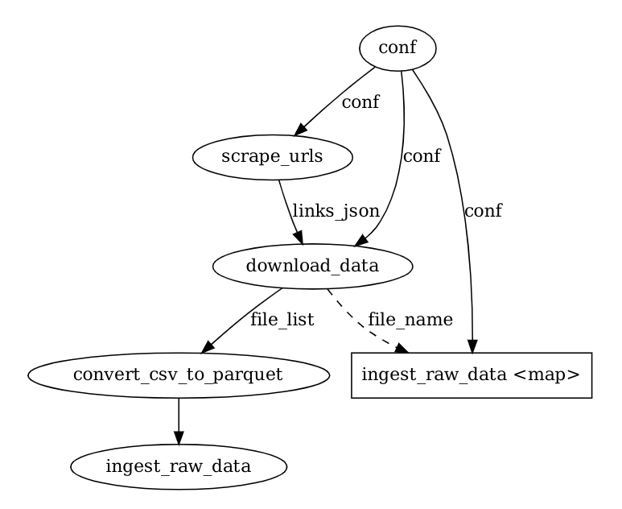

## NYC Taxi Trip DWH Project

This is a project repo which is extending the [Data Engineering Zoomcamp](https://github.com/DataTalksClub/data-engineering-zoomcamp) in a more generic way.
This project helps in understanding in general how data engineering workflows would work

### Pipeline Steps
- Initially the urls for the `raw_data` are scraped using `BeautifulSoup (bs4)` and stored in a `json`
- Based on the configuration `TOML` the data is downloaded into the `nyc_raw_data` directory
- Once the `data` is present the ingestion takes place into a Local `postgres db` using `LocalDaskExecutor` from [prefect](https://docs.prefect.io/api/latest/executors.html)

### Pipeline Visualization
The Local Postgres Pipeline is as below:
